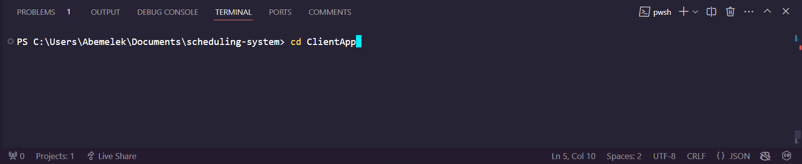
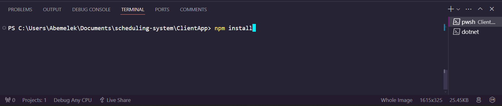
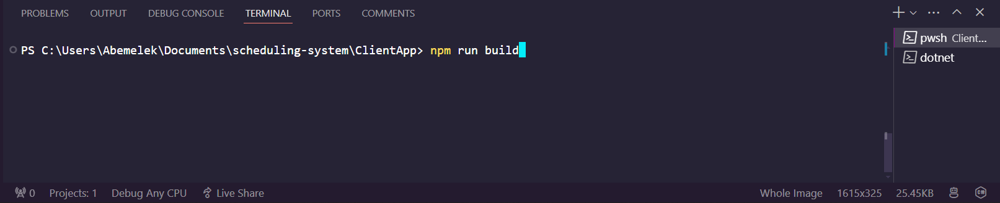
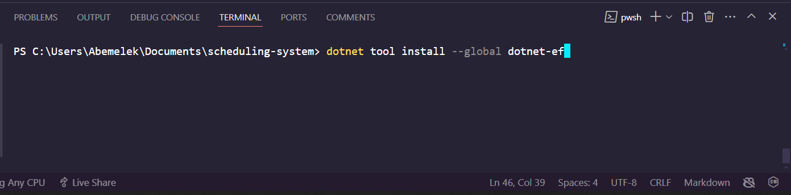
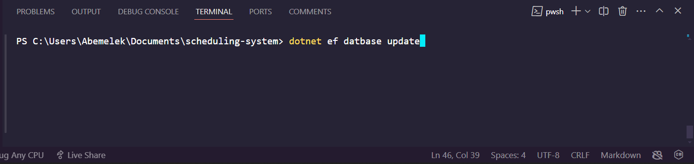
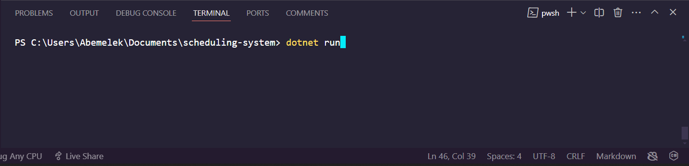
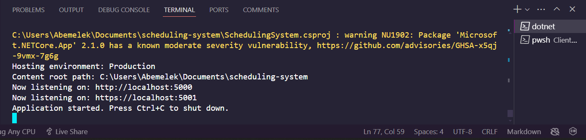

# iScheduler 2.0


Welcome to iScheduler 2.0, this is an improved version (the old version can be found [here](https://github.com/nebiyuelias1/genetic-algorithm-based-scheduling-system)) of a project I did for my final project during my undergraduate study. The SRS document can be accessed [here](https://drive.google.com/file/d/10PftuBFP1mT_ty_PW3v7BaDuwwUc_ozZ/view?usp=sharing).

The App is designed specifically for Ethiopian universities and it solves the problem of generating class timetables automatically. I've utilized a [genetic algorithm](https://en.wikipedia.org/wiki/Genetic_algorithm) for this purpose and it's very interesting how the algorithm works.

No more manual headaches or conflicting schedules. Our app intelligently balances course offerings, faculty availability, and student preferences to deliver optimized schedules that maximize resources and minimize conflicts.

[](https://dotnet.microsoft.com/download) 
[](https://nodejs.org/) 
[](https://angular.io/cli) 
[](https://www.microsoft.com/en-us/sql-server/sql-server-downloads)

## Prerequisites

Before you begin, make sure you have the following installed on your machine:

1. [.NET Core SDK](https://dotnet.microsoft.com/download)
2. [Node.js and npm](https://nodejs.org/)
3. [Angular CLI](https://angular.io/cli)
4. [SQL Server](https://www.microsoft.com/en-us/sql-server/sql-server-downloads)

## Setting Up the Database

1. Install SQL Server if you haven't already.
2. Create a new database for the project. You can do this using [SQL Server Management Studio](https://learn.microsoft.com/en-us/sql/ssms/download-sql-server-management-studio-ssms?view=sql-server-ver16) or any other preferred method.
3. Update the connection string in `appsettings.json` file in the ASP.NET Core project (`scheduling-system/appsettings.json`) to point to your newly created database.

```json
"ConnectionStrings": {
    "DefaultConnection": "Server=localhost;Database=YourDatabaseName;Trusted_Connection=True;MultipleActiveResultSets=true"
}
```

## Building the Angular Client
1. Navigate to the root directory of the Angular project in your terminal or command prompt:
```
cd ClientApp
```

2. Run the following command to install the required dependencies:
```
npm install
```

3. After the installation is complete, run the following command to build the Angular Client:
```
npm run build
```

4. The Angular application should now be built under the `dist` directory.

## Running the ASP.NET Core API
1. Navigate to the root directory of the ASP.NET Core project in your terminal or command prompt.
2. Run the following command to restore dependencies:
```
dotnet restore
```

3. Install entity framework globally:
```
dotnet tool install --global dotnet-ef
```

4. After the restoration is complete, run the following command to apply any pending migrations and seed data:
```
dotnet ef database update
```

5. Once the database is updated, run the following command to start the ASP.NET Core API:
```
dotnet run
```

6. The API should now be running on https://localhost:5001 (or http://localhost:5000).


## Accessing the Application
You can now access the application by visiting https://localhost:5001 in your web browser. Your browser might complain about the URL not being secure but you can simply proceed because this is just a development server. Look at the [howtouse.md](/howtouse.md) file for more details about using the app.

## References
For those interested in delving deeper into the Genetic Algorithm utilized in our app, I recommend exploring the following research:

[[1]](https://ieeexplore.ieee.org/abstract/document/7577525) S. Parera, H. T. Sukmana and L. K. Wardhani, "Application of genetic algorithm for class scheduling (Case study: Faculty of science and technology UIN Jakarta)," 2016 4th International Conference on Cyber and IT Service Management, Bandung, Indonesia, 2016, pp. 1-5

[[2]](https://iopscience.iop.org/article/10.1088/1742-6596/995/1/012050/meta) Ahmad, Izah R., et al. "A heuristics approach for classroom scheduling using genetic algorithm technique." Journal of physics: Conference series. Vol. 995. No. 1. IOP Publishing, 2018.

[[3]](https://iopscience.iop.org/article/10.1088/1742-6596/953/1/012067/meta) Saptarini, N. G. A. P. H., I. W. Suasnawa, and P. I. Ciptayani. "Senior high school course scheduling using genetic algorithm." Journal of Physics: Conference Series. Vol. 953. No. 1. IOP Publishing, 2018.


